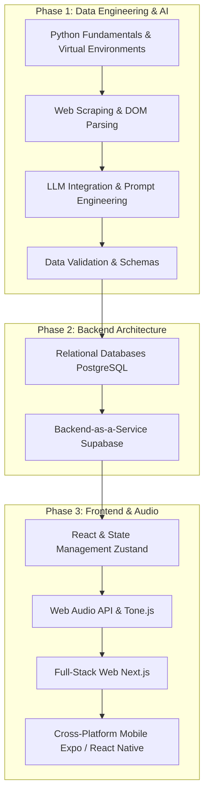

# Saptaswara Development Journal & Learning Guide

This file tracks our daily progress, outlines our next steps, and serves as a continuous learning roadmap for building a full-stack, AI-driven application like Saptaswara.

---

---

## 📅 Date: 2026-04-09

### ✅ Work Completed Today
1. **Piano Instrument Implementation**: Piano was listed in the UI but produced no sound. Added `case 'piano'` to `buildTimbreNode` in `audio.ts` — a triangle-oscillator `PolySynth` with piano-shaped ADSR (5 ms attack, 300 ms decay, 0.2 sustain, 1.5 s release).
2. **Custom Instrument Dropdown**: Replaced the broken native `<select>` in `Piano.tsx` with a fully custom React dropdown. Native `<select>` + `<optgroup>` on dark backgrounds renders with OS defaults on Chrome/Linux — white background, invisible text. The new dropdown is a dark-themed popover (`bg-[#1a1a2e]`) with click-outside close via `useRef`/`useEffect`.
3. **Removed Percussion from Melodic Selector**: `tabla` and `mridangam` were listed as melodic instruments but are intentionally silent in that path (percussion uses a separate synthesis chain). Removed them from `INSTRUMENT_GROUPS` and added a **Western** group containing Piano.
4. **Updated Backward-Compat Shim**: Fixed `setInstrument()` so `'piano'` now routes to the real piano timbre instead of falling back to harmonium.
5. **ARCHITECTURE.md Generated**: Comprehensive 12-section architecture document written covering directory tree, every API route with auth/rate-limit/schema details, AI pipeline, all DB tables with RLS policies, 3 end-to-end user journey traces, and local dev setup.

### 🎯 Plan for Tomorrow (Next Steps)
1. **Metronome UI**: Add an audible/visual metronome to the studio playback rail — beat dots that flash and a click sound at the current BPM.
2. **Sampler Piano**: Optionally replace the triangle-synth piano with the Tone.js Salamander sampler for realistic key sounds.
3. **Mobile Scaffold**: Begin React Native / Expo scaffold for the mobile app surface.
4. **Export Flow**: Wire up the MIDI export API to the studio sequencer grid so a recorded composition can be downloaded as a `.mid` file.

---

## 📅 Date: 2026-04-08

### ✅ Work Completed Today
1. **Metronome Concept Landed**: Agreed on architecture for BPM-as-metronome in the studio playback rail — visual beat dots that flash per beat + audible click via a `MembraneSynth` click voice at the current BPM.
2. **Broken Instrument Dropdown Diagnosed**: Traced the root cause — Chrome/Linux renders native `<select>` option lists with the OS light theme regardless of `colorScheme: 'dark'`, making dark text on white background invisible. Custom dropdown solution scoped.
3. **Piano Gap Identified**: `InstrumentType` in `compositionReducer.ts` was missing `'piano'`. Added it. `audio.ts` `InstrumentName` also lacked `'piano'` — added it in preparation for tomorrow's timbre implementation.
4. **End-to-End Architecture Documented**: Traced and explained the full data flow separately for frontend (user gesture → context dispatch → AudioEngine → Tone.js) and backend (Next.js route → Supabase RLS → DB → AI → response).

### 🎯 Plan for Tomorrow (Next Steps)
- Implement piano timbre in `buildTimbreNode`
- Replace `<select>` with custom dropdown in Piano.tsx
- Verify all other instruments are audible

---

## 📅 Date: 2026-04-07

### ✅ Work Completed Today
1. **DrumPad Full Rewrite**: Rewrote `DrumPad.tsx` from scratch. New features: keyboard shortcuts A–J for tabla strokes, A–D for mridangam, `onStroke` callback prop for sequencer recording integration, 120 ms flash animation per pad, instrument toggle (Tabla/Mridangam), keyboard legend row.
2. **Studio Input Switching Fixed**: Studio was always showing Piano even when a rhythm track was selected. Fixed: active track type now determines the input rendered — rhythm tracks get `<DrumPad onStroke={...}>`, all other types get `<Piano>`.
3. **Percussion → Sequencer Recording**: DrumPad's `onStroke` prop wired to `handleToggleStep` in studio — tapping a drum pad while playback is running now records the stroke into the active step of the rhythm track.
4. **Phrase Detection Crash Fixed**: `RagaEngine.detectPhrases` was throwing `Cannot read properties of undefined (reading 'join')` because some raga records in the DB store `phrase.sequence` as `null`. Added a guard: `if (!Array.isArray(p.sequence) || p.sequence.length === 0) return`.
5. **Vadi/Samvadi "Unknown" Fixed**: Library detail panel was displaying literal "Unknown" for Vadi/Samvadi when the DB stores that string. Added `displaySwara()` helper that maps `'unknown'`, `'n/a'`, `'classical'`, `''` → `'—'`.
6. **"ANY" Time of Day Hidden**: The `time_of_day: "ANY"` label was showing in the raga header. Hidden it with a conditional render check.

### 🎯 Plan for Tomorrow (Next Steps)
- Fix broken instrument dropdown
- Implement piano sound
- Add metronome to studio

---

## 📅 Date: 2026-04-06

### ✅ Work Completed Today
1. **Multi-Track System Implemented**: Full rewrite of `apps/web/app/studio/page.tsx`. Six track types: `melody`, `rhythm`, `vocal`, `bass`, `drone`, `pad`. Each track has mute, solo (exclusive), per-track volume, and a colour identity. The Add Track panel supports adding any type with a default name.
2. **Velocity Per Step**: Shift-clicking a step cycles its velocity through 25 → 50 → 75 → 100% and back. Each step cell renders a bottom fill bar proportional to velocity.
3. **Swing Control**: Added a Swing slider (0–50%) in the playback rail. Playback uses a recursive `setTimeout` chain (not `setInterval`) so swing-aware timing works: even steps are stretched, odd steps are compressed around the base beat duration.
4. **Loop Length Selector**: 8 / 16 / 32 step options. Changing loop length resizes all track sequences in place (truncates or pads with `null`).
5. **Raga Constraint on Piano**: Piano `onNoteClick` silently rejects notes outside `raga.aroha ∪ raga.avaroha` when Scale Lock is on — enforces raga grammar on melodic input.
6. **Stale Closure Fix**: Sequencer playback used `useRef` mirrors of `tracks`, `bpm`, `swing`, and `loopLength` so the recursive `setTimeout` callback always reads the latest values without re-registering the timer.
7. **Library Sidebar Overlap Fixed**: The raga detail sidebar in `library/page.tsx` was using `absolute right-0` positioning (outside flex flow), causing it to overlay the card grid. Changed to always-in-flow `flex-shrink-0` element with `w-0` ↔ `w-[440px]` CSS transition for smooth push-open animation.

### 🎯 Plan for Tomorrow (Next Steps)
- Rewrite DrumPad with keyboard bindings
- Fix studio always rendering Piano for rhythm tracks
- Fix phrase detection crash

---

## 📅 Date: 2026-04-03 — 2026-04-05

### ✅ Work Completed
1. **AudioEngine "Already Disposed" Fix**: Navigating away from the studio and back caused `Synth was already disposed` errors. Root cause: studio was calling `audioEngine?.dispose()` on unmount, but `audioEngine` is a module-level constant — the disposed reference was reused on remount. Fix: changed unmount to `audioEngine?.stopAll()` (keeps the instance alive), and made `dispose()` set `_instance = null` so `getAudioEngine()` creates a fresh instance on the next visit.
2. **Raga Loading States**: Studio page now shows a proper loading spinner while ragas are fetching, and an error banner with a retry button if the fetch fails. The "Searching…" HUD text no longer persists after ragas load.
3. **16-Step Sequencer Grid**: Made the sequencer grid always visible (not gated behind raga selection), with beat-marker labels at positions 1, 5, 9, 13 and velocity fill bars per step.
4. **Instrument Timbre Library Expanded**: Added synthesis models for harmonium (2× detuned sawtooth), sitar (PluckSynth + PitchShift shimmer), sarangi (FMSynth + Reverb), veena (PluckSynth + LFO pitch wobble), bansuri (FMSynth + NoiseSynth breath), tambura (AMSynth with slow meditative drone sequence), tabla/mridangam (silent PolySynth — percussion only).

---

## 📅 Date: 2026-03-28

### ✅ Work Completed Today
1. **Vercel Build Errors Resolved**: Fixed a cascade of build failures on Vercel — missing `projects` library, broken workspace redirect, and `useSearchParams` called outside a Suspense boundary in studio page.
2. **Projects Page Default Export**: Added the missing default export that was causing a blank page render.
3. **Incremental Build Cache Busted**: Disabled incremental TypeScript compilation (`incremental: false`) to prevent stale `.tsbuildinfo` artifacts from surfacing phantom type errors on Vercel.

---

### 2026-03-27: The Resonant Void Transition
We have successfully transitioned the Saptaswara UI to the "Resonant Void" design system. The transformation has turned a functional dashboard into a premium, studio-grade aesthetic.
- **Visuals**: Dark mode obsidian palettes, tonal layering instead of lines, and gorgeous glassmorphism.
- **Typography**: A balanced mix of Manrope, DM Sans, and Space Grotesk.
- **Engineering**: The multi-track audio engine is fully integrated into the new workspace.
- **Next Steps**: Refine rhythm patterns and finalize project sharing.

---

## 📅 Date: 2026-03-24

### ✅ Work Completed Today
1. **Initialised Project Architecture**: Created the foundational monorepo-style folder structure for `tools/`, `packages/core/`, `backend/`, `apps/web/`, and `apps/mobile/`.
2. **Configured Environment**: Set up `.gitignore`, `.env.example`, and baseline JSON configuration files for TypeScript and Node packages.
3. **Data Pipeline Code**: Integrated the user-provided Python code for **Tool 1** (`scraper.py`) and **Tool 2** (`structurer.py`).
4. **Environment Isolation**: Encountered system-level Python dependency conflicts and resolved them by isolating the project's dependencies within a Python virtual environment (`venv`). Created a comprehensive `requirements.txt`.

### 🎯 Plan for Tomorrow (Next Steps)
1. **Execute Phase 1 (Data Collection)**:
    - Ensure API keys are loaded into the `.env` file.
    - Run `scraper.py` to fetch the raw raga data from amitray.com.
    - Run `structurer.py` to send that raw data through Gemini and produce the structured `raga_catalogue.json`.
2. **Review & Fix**: Manually inspect the resulting JSON and the generated `raga_errors.json` file. Refine prompt engineering if needed.
3. **Begin Tool 3 (Validator)**: Start building the Flask interface to visually review the Gemini-structured raga data before pushing it to the backend.

---

## 🧠 Saptaswara Learning Guide

To build a modern, cross-platform, AI-integrated app like Saptaswara, you need to understand the flow of data from the messy web all the way to interactive user interfaces.

Here is the learning path to master this stack:

### 📚 Recommended Sources & References
- **Python & Venv**: [Official Python venv docs](https://docs.python.org/3/library/venv.html)
- **Web Scraping**: [Beautiful Soup Documentation](https://www.crummy.com/software/BeautifulSoup/bs4/doc/)
- **Data Validation**: [Pydantic Documentation](https://docs.pydantic.dev/latest/)
- **LLM Integrations**: [Google Gemini API Docs](https://ai.google.dev/docs)
- **Database & Backend**: [Supabase Crash Course / Docs](https://supabase.com/docs)
- **Frontend / Full-stack**: [Next.js Foundations](https://nextjs.org/learn)
- **Web Audio**: [Tone.js Documentation](https://tonejs.github.io/)

---

## 📊 Honest Path Rating: 9/10

**Why 9/10?**
Building Saptaswara touches almost every modern facet of software engineering. You aren't just building a standard CRUD (Create, Read, Update, Delete) app. You are learning:
1. **Unstructured to Structured Data Pipelines**: Taking messy HTML, using modern AI as a parsing engine, and enforcing strict data schemas.
2. **Modern Database Management**: Handling authentication and rapid database provisioning via Supabase.
3. **Complex Frontend State**: Managing real-time audio contexts and composition states across web and mobile surfaces.

**The missing 1/10**: It is a deeply challenging path. Managing the Web Audio API (cross-browser audio latency) and bridging the gap between web React (Next.js) and mobile React (Expo) can be frustrating for a single developer. However, if you master this exact stack, you will be in the top percentile of full-stack engineers able to build production-scale, AI-native applications.
