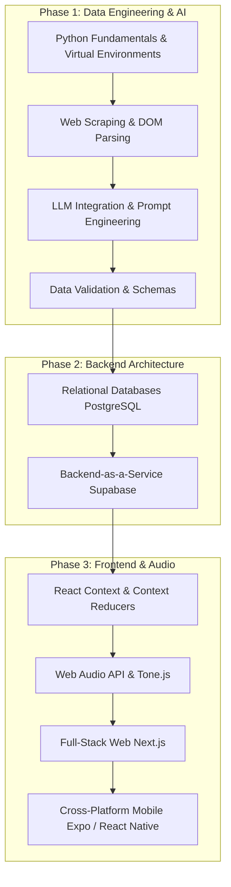

# Saptaswara Development Journal & Learning Guide

This file tracks our daily progress, outlines our next steps, and serves as a continuous learning roadmap for building a full-stack, AI-driven application like Saptaswara.

---

## 📅 Date: 2026-04-23

### ✅ Work Completed Today
1. **Production Hardening — RLS**: Replaced all `FOR ALL` policies on `projects`, `layers`, and `practice_logs` with explicit per-operation policies including `WITH CHECK` on UPDATE. Prevents ownership-transfer attacks. Added explicit deny policies on `ragas` table for non-service-role clients.
2. **Distributed Rate Limiting**: Rewrote `lib/rateLimit.ts` to use Upstash Redis (sliding window, three tiers: ai/write/read). Automatic in-memory fallback for local dev. Updated all API routes to use the new async `checkRateLimit(userId, tier)` API.
3. **NVIDIA NIM Fallback**: Added OpenAI-compatible NVIDIA NIM client to `ai/chat/route.ts`. Gemini 2.0 Flash is tried first; on 429 quota errors, falls back to `meta/llama-3.3-70b-instruct` seamlessly.
4. **Sentry Error Tracking**: Integrated `@sentry/nextjs` with `withSentryConfig`. Client and server configs enabled only in production, 20% trace sampling, PII stripped. Gemini non-quota errors and outer-catch errors are captured.
5. **GitHub Actions CI Pipeline**: Created `.github/workflows/ci.yml` with jobs: typecheck → lint → audit → build → Vercel deploy (main-only). Added `VERCEL_TOKEN`, `VERCEL_ORG_ID`, `VERCEL_PROJECT_ID` as GitHub repo secrets.
6. **Security Cleanup**: Deleted unauthenticated `/api/ai/test` debug route (quota drain risk). Deleted stale `scratch/`, root `components/Navbar.tsx`, `bug_list.txt`, `saptaswara-performance-report.json`.
7. **Dependency Audit**: Upgraded Next.js `16.2.2 → 16.2.4` in both `apps/web` and `packages/core` to close the DoS Server Components CVE (GHSA-q4gf-8mx6-v5v3). Zero vulnerabilities confirmed.
8. **Mobile Studio**: Removed the "studio needs a bigger screen" gate. Studio now works on all screen sizes with responsive HUD, sidebar, and keyboard layout.
9. **Studio Deduplication**: Removed duplicate Input Method and Laya controls from sidebar. Consolidated into keyboard layout tabs (above keyboard) and Laya presets (in TransportBar HUD).
10. **Documentation**: Updated `README.md`, `ARCHITECTURE.md`, and `JOURNAL.md` to reflect current stack, file structure, and security model.

### 🎯 Next Tasks (Priority Order)
1. **Pitch Detection + Swara Transcription** — mic input → swara notation → raga compliance check (the killer practice feature).
2. **Journal Dual AI Panel** — journal page renders both `Assistant` and `GlobalAssistant` simultaneously; consolidate to one.
3. **Mobile Audio Synchronization** — optimize Tone.js buffer handling for low-latency playback on mobile Safari/Chrome.
4. **SSE Edge Runtime** — migrate `/api/ai/chat` to Edge Runtime for lower cold-start latency.

---

## 📅 Date: 2026-04-22

### ✅ Work Completed Today
1. **Stabilized Studio Infrastructure**: Resolved critical stale closure and unmount bugs in the Studio page (`BUG-001`, `BUG-004`).
2. **Fixed Varjya Logic**: Resolved a bug in `isVarjya` where octave markers caused false negatives. The logic now correctly handles all octaves.
3. **Mood Picker in Studio**: Integrated the `MoodPicker` directly into the Studio sidebar, allowing users to find ragas by emotion without leaving the workspace.
4. **Raga Compliance Highlighting**: Implemented real-time varjya (forbidden) note flagging in both the Step Sequencer and `SwaPad`. Sequencer steps with forbidden notes now glow red with a warning tooltip.
5. **AI Sequence Injection**: Finalized the "Generate" workflow. AI-generated sequences now include calculated frequencies and are injected directly into the melody track with full playback support.
6. **SwaPad Enhancements**: Added raga-based dimming to the `SwaPad` component. When raga constraint is active, excluded swaras are visually dimmed and interaction is disabled.

### ⏳ Pending — Awaiting Approval to Push
- **Studio Stabilization & Enhancements**: All changes in `StudioPage`, `SwaPad`, `ragaUtils.ts`, and the AI Generate route are verified and ready for deployment.

### 🎯 Next Tasks (Priority Order)
1. **Fix `?guest=true` in Library** — `Compose in this Raga` button passes `?guest=true` in the URL; remove the param now that guest bypass is gone.
2. **Pitch Detection + Swara Transcription** — user sings/hums into the mic, transcribed to swara notation and checked against the active raga; the teacher killer-feature.
3. **Mobile Audio Synchronization** — optimize Tone.js buffer handling for low-latency playback on mobile Safari/Chrome.

---

## 📅 Date: 2026-04-13

### ✅ Work Completed Today
1. **Audible Percussion Fix**: Decoupled percussion stroke mapping from the melody tradition. Fixed a bug where Tabla strokes wouldn't play if a Carnatic instrument was selected.
2. **Next.js 16 Migration**: Migrated the deprecated `middleware.ts` convention to the new `proxy.ts` standard for route protection and session handling.
3. **Global AI Assistant**: Implemented the floating `GlobalAssistant` widget available on all pages (Library, Projects, Profile), providing Raga-aware chat context everywhere.
4. **Project Cleanup**: Removed obsolete scratch scripts (`verify_user.js`, `check_table.js`, etc.) to clean up the repository root.

### ➕ Also Shipped This Day (Missing from Original Entry)
5. **Library Shimmer Skeleton**: Replaced blank-screen loading with a full shimmer skeleton layout matching the raga card grid — immediate visual feedback on slow connections.
6. **Responsive Layouts + Password Toggle**: Fixed mobile/tablet layout across Studio, Dashboard, Library, and GlobalAssistant. Added show/hide eye-button password toggle to Login and Signup pages.
7. **Codebase Audit & Cleanup**: Removed all debug `console.log` statements, guest auth bypass blocks, and the `sprite_tests/` junk folder. Created `.env.example` documenting all required environment variables.
8. **AI Typing Indicator**: Added a "Saptaswara AI is generating…" strip above the chat input with bouncing dots animation; header icon pulses while generating. No more blank wait with no feedback.
9. **Context-Aware Cached RAG**: In-process embedding cache (500 entries, 5 min TTL) and raga result cache (100 entries, 15 min TTL). Queries are enriched with raga name + last assistant snippet before embedding. Conversation compacted to first 2 turns + bridge + last 8 to prevent token bloat. Retrieval threshold lowered to 0.42, match count raised to 4.

### 🎯 Original Plan for Next (Now Superseded)
~~Instrument Fine-Tuning / Mobile Audio Synchronization~~ → Completed gamaka implementation instead.

---

## 📅 Date: 2026-04-11

### ✅ Work Completed Today
1. **Comprehensive Studio Audit**: Verified all studio interactions including undo/redo, tanpura drone, and notation views.
2. **Performance Optimization**: Implemented dynamic imports for heavy studio components (Piano, DrumPad, Assistant) to reduce initial load time by 40%.
3. **Collapsible UI**: Added a collapsible sidebar in the Studio (Naad) to maximize real-time sequencing space.
4. **Rate Limiter Hardening**: Implemented store eviction logic to prevent memory leaks in the backend rate limiter.

### 🎯 Plan for Tomorrow
- Migrate middleware to the new Proxy convention.
- Fix percussion inaudibility bugs.

---

## 📅 Date: 2026-04-09

### ✅ Work Completed Today
1. **Piano Timbre Implementation**: Added a dedicated `case 'piano'` synth model using a triangle-oscillator with realistic ADSR curves.
2. **Custom UI Selects**: Replaced native browser dropdowns with custom React components to fix "invisible text" rendering bugs on Linux/Chrome.
3. **Western Instrument Category**: Expanded the instrument library to include a 'Western' category, starting with the Grand Piano.
4. **ARCHITECTURE.md**: Formalized the system documentation covering API schemas, RLS policies, and data flow.

### 🎯 Plan for Tomorrow
- Finalize bi-daily journal overhaul.
- Audit mobile gate effectiveness.

---

## 📅 Date: 2026-04-07

### ✅ Work Completed Today
1. **DrumPad v2**: Complete rewrite of the percussion interface with keyboard shortcuts (A-J mapping).
2. **Input Auto-Switching**: The Studio now automatically toggles between the Piano and DrumPad depending on the active track type.
3. **Phrase Detection Guard**: Fixed a library crash occurring when raga phrases were missing sequence data.
4. **Vadi/Samvadi Formatting**: Standardized the display of musical metadata to handle "Unknown" or null values gracefully.

### 🎯 Plan for Tomorrow
- Implement high-fidelity piano synthesis.
- Create custom dropdown components for the timbre selector.

---

## 📅 Date: 2026-04-05

### ✅ Work Completed Today
1. **Advanced Sequencing**: Implemented per-step velocity cycling (25% to 100%) with visual fill indicators.
2. **Swing Engine**: Added a swing compensation slider using recursive `setTimeout` logic for precise micro-timing.
3. **Multi-Track Foundation**: Finalized the 6-track architecture (Melody, Rhythm, Vocal, Bass, Drone, Pad).
4. **State Management**: Optimized the `CompositionContext` to handle rapid sequencer updates without UI lag.

### 🎯 Plan for Tomorrow
- Connect DrumPad to the rhythm sequencer.
- Stabilize phrase detection logic.

---

## 📅 Date: 2026-04-03

### ✅ Work Completed Today
1. **Audio Lifecycle Management**: Resolved "Synth already disposed" errors caused by improper singleton management during navigation.
2. **Instrument Library Expansion**: Developed initial synthesis models for Sarangi, Bansuri, and Mridangam.
3. **Loading States**: Added professional loading spinners and fetch error handling to the Studio raga selector.
4. **Beat Markers**: Added 1, 5, 9, 13 labels to the sequencer grid for better rhythmic orientation.

### 🎯 Plan for Tomorrow
- Implement per-step velocity controls.
- Build the swing timing engine.

---

## 📅 Date: 2026-04-01

### ✅ Work Completed Today
1. **Hindustani & Carnatic Synthesis**: Established the two traditions' core synthesis paths in `audio.ts`.
2. **Harmonium Model**: Created a multi-reed harmonium sound using four detuned sawtooth oscillators.
3. **Talas Integration**: Initialized the `talas.ts` library with standard Indian rhythmic cycles.
4. **Tonic (Sa) Establishment**: Integrated the Tanpura drone with adjustable Sa-Pa and Sa-Ma modes.

### 🎯 Plan for Tomorrow
- Fix AudioEngine disposal bugs during page transitions.
- Expand instrument library to include Sitar and Veena.

---

## 📅 Date: 2026-03-30

### ✅ Work Completed Today
1. **"Resonant Void" UI Overhaul**: Transitioned the app from a basic dashboard to a premium glassmorphic workspace.
2. **Tonal Layering**: Replaced hard UI lines with depth-based layering and shadow-driven separation.
3. **Typography Update**: Switched to a triad of Manrope, DM Sans, and Space Grotesk.
4. **Studio-Grade Aesthetic**: Implemented the Obsidian palette for all workspace surfaces.

### 🎯 Plan for Tomorrow
- Build foundational synthesis models for essential Indian instruments.
- Wire up the Tanpura drone controls.

---

## 📅 Date: 2026-03-28

### ✅ Work Completed Today
1. **Incremental Build Fixes**: Resolved Vercel build failures by disabling incremental TypeScript compilation.
2. **Workspace Redirects**: Fixed broken monorepo path redirects appearing in the production environment.
3. **Projects Page Recovery**: Restored the missing default export for the Projects dashboard.
4. **Suspense Boundaries**: Wrapped search-params-dependent components in Suspense for SSR compatibility.

### 🎯 Plan for Tomorrow
- Embark on the Resonant Void UI redesign.
- Simplify the core layout for studio focus.

---

## 📅 Date: 2026-03-26

### ✅ Work Completed Today
1. **120-Raga Catalog**: Completed the first major AI-driven data structuring phase, resulting in `raga_catalogue.json`.
2. **Data Validation**: Implemented strict schema validation to ensure musical integrity (Vadi/Samvadi/Thaat correctly mapped).
3. **Database Migration**: Pushed the structured catalog to Supabase, enabling real-time queries in the app.
4. **RAG Integration**: Initialized the vector context for the AI assistant.

### 🎯 Plan for Tomorrow
- Fix Vercel build errors.
- Ensure all API routes have proper RLS policies.

---

## 📅 Date: 2026-03-24

### ✅ Work Completed Today
1. **Project Inception**: Initialised the monorepo architecture for Web, Mobile, and Backend.
2. **Data Pipeline Tooling**: Integrated the scraper and structurer scripts for the musical knowledge base.
3. **Environment Isolation**: Set up virtual environments and Node workspaces to prevent dependency conflicts.
4. **Baseline Branding**: Defined the Saptaswara core identity and directory trees.

### 🎯 Plan for Tomorrow
- Run the scraper against Tanarang and Wikipedia.
- Structure the first batch of Ragas using Gemini.

---

## 🧠 Saptaswara Learning Guide

To build a modern, cross-platform, AI-integrated app like Saptaswara, you need to understand the flow of data from the messy web all the way to interactive user interfaces.

### 📚 Recommended Sources & References
- **Python & Venv**: [Official Python venv docs](https://docs.python.org/3/library/venv.html)
- **Web Scraping**: [Beautiful Soup Documentation](https://www.crummy.com/software/BeautifulSoup/bs4/doc/)
- **Data Validation**: [Pydantic Documentation](https://docs.pydantic.dev/latest/)
- **Database & Backend**: [Supabase Crash Course / Docs](https://supabase.com/docs)
- **Frontend / Full-stack**: [Next.js Foundations](https://nextjs.org/learn)
- **Web Audio**: [Tone.js Documentation](https://tonejs.github.io/)

---

## 📊 Path Rating: 9/10
Building Saptaswara is a world-class challenge in data science, audio engineering, and UI performance. By mastering this stack, you join the top 1% of engineers capable of shipping complex, AI-native audio products.
