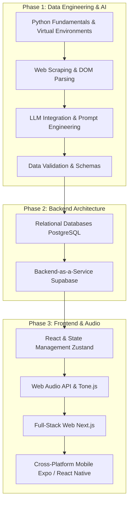

# Saptaswara Development Journal & Learning Guide

This file tracks our daily progress, outlines our next steps, and serves as a continuous learning roadmap for building a full-stack, AI-driven application like Saptaswara.

---

### 2026-03-27: The Resonant Void Transition
We have successfully transitioned the Saptaswara UI to the "Resonant Void" design system. The transformation has turned a functional dashboard into a premium, studio-grade aesthetic.
- **Visuals**: Dark mode obsidian palettes, tonal layering instead of lines, and gorgeous glassmorphism.
- **Typography**: A balanced mix of Manrope, DM Sans, and Space Grotesk.
- **Engineering**: The multi-track audio engine is fully integrated into the new workspace.
- **Next Steps**: Refine rhythm patterns and finalize project sharing.

---

## 📅 Date: 2026-03-24

### ✅ Work Completed Today
1. **Initialised Project Architecture**: Created the foundational monorepo-style folder structure for `tools/`, `packages/core/`, `backend/`, `apps/web/`, and `apps/mobile/`.
2. **Configured Environment**: Set up `.gitignore`, `.env.example`, and baseline JSON configuration files for TypeScript and Node packages.
3. **Data Pipeline Code**: Integrated the user-provided Python code for **Tool 1** (`scraper.py`) and **Tool 2** (`structurer.py`).
4. **Environment Isolation**: Encountered system-level Python dependency conflicts and resolved them by isolating the project's dependencies within a Python virtual environment (`venv`). Created a comprehensive `requirements.txt`.

### 🎯 Plan for Tomorrow (Next Steps)
1. **Execute Phase 1 (Data Collection)**:
    - Ensure API keys are loaded into the `.env` file.
    - Run `scraper.py` to fetch the raw raga data from amitray.com.
    - Run `structurer.py` to send that raw data through Gemini and produce the structured `raga_catalogue.json`.
2. **Review & Fix**: Manually inspect the resulting JSON and the generated `raga_errors.json` file. Refine prompt engineering if needed.
3. **Begin Tool 3 (Validator)**: Start building the Flask interface to visually review the Gemini-structured raga data before pushing it to the backend.

---

## 🧠 Saptaswara Learning Guide

To build a modern, cross-platform, AI-integrated app like Saptaswara, you need to understand the flow of data from the messy web all the way to interactive user interfaces.

Here is the learning path to master this stack:

### 📚 Recommended Sources & References
- **Python & Venv**: [Official Python venv docs](https://docs.python.org/3/library/venv.html)
- **Web Scraping**: [Beautiful Soup Documentation](https://www.crummy.com/software/BeautifulSoup/bs4/doc/)
- **Data Validation**: [Pydantic Documentation](https://docs.pydantic.dev/latest/)
- **LLM Integrations**: [Google Gemini API Docs](https://ai.google.dev/docs)
- **Database & Backend**: [Supabase Crash Course / Docs](https://supabase.com/docs)
- **Frontend / Full-stack**: [Next.js Foundations](https://nextjs.org/learn)
- **Web Audio**: [Tone.js Documentation](https://tonejs.github.io/)

---

## 📊 Honest Path Rating: 9/10

**Why 9/10?**
Building Saptaswara touches almost every modern facet of software engineering. You aren't just building a standard CRUD (Create, Read, Update, Delete) app. You are learning:
1. **Unstructured to Structured Data Pipelines**: Taking messy HTML, using modern AI as a parsing engine, and enforcing strict data schemas.
2. **Modern Database Management**: Handling authentication and rapid database provisioning via Supabase.
3. **Complex Frontend State**: Managing real-time audio contexts and composition states across web and mobile surfaces.

**The missing 1/10**: It is a deeply challenging path. Managing the Web Audio API (cross-browser audio latency) and bridging the gap between web React (Next.js) and mobile React (Expo) can be frustrating for a single developer. However, if you master this exact stack, you will be in the top percentile of full-stack engineers able to build production-scale, AI-native applications.
