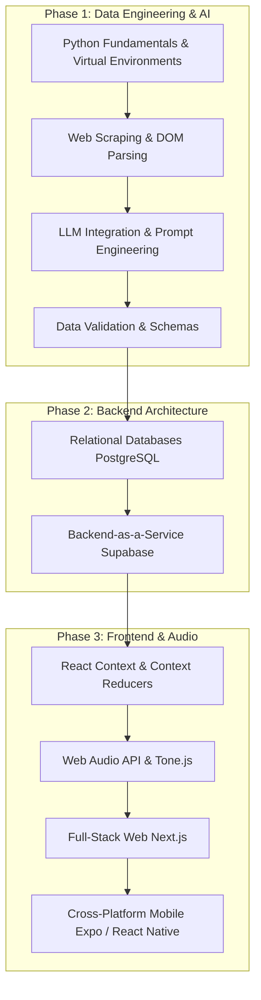

# Saptaswara Development Journal & Learning Guide

This file tracks daily progress, next steps, and serves as a continuous learning roadmap for building Saptaswara.

---

## 📅 Date: 2026-05-03

### ✅ Work Completed Today

1. **Mastering EQ Signal Chain Fix**: Root cause — `masterOutput.toDestination()` bypassed the EQ entirely. All instruments connected to `masterOutput`, not `masterEQ`. Fixed by removing `masterOutput.toDestination()` and routing `masterOutput.chain(masterEQ, limiter, Tone.getDestination())`. Mastering presets (NEUTRAL/WARM/CLEAR/BRIGHT/DEEP) now have audible effect.

2. **Unique Raga Card Visuals**: All 120+ cards previously shared 3 identical atmosphere images. Added `ragaHash()` (polynomial hash of raga name) to derive a deterministic `hue-rotate` angle (24 steps × 15° = 0–345°) and one of 8 rgba tint colors. Same raga name → same appearance every time. Cards now have 192 visually distinct combinations from 3 images.

3. **Card Image White Wash Fix**: Replaced `from-surface-lowest` gradient overlay (resolves to `#FFFFFF` in light mode = pure white wash) with `from-black/65 via-black/15` dark scrim. Images visible in both themes. All card text changed to `text-white/*` to contrast against the dark scrim.

4. **AI Assistant Light Mode Fix**: Chat bubble used `to-primary-container` gradient (resolves to `#EAE4FF` pale lavender in light mode) with white text = invisible. Changed all 3 gradient instances to `from-primary to-primary/60` — stays dark in both themes.

5. **Immersive Aroha/Avaroha Side Panels**: Replaced flex-row wrapper (which compressed keyboard width) with two `position: fixed` viewport-edge panels. Left panel = Aroha ↑, right panel = Avaroha ↓. Each swara shows its QWERTY keyboard label in a `<kbd>` chip. Keyboard always gets full width.

6. **Removed Immersive Top Reference Bar**: Removed the fixed top bar showing raga name + aroha + avaroha + vadi + samvadi in immersive mode. Side panels replace its function.

7. **Remember Me on Login**: Added checkbox to login page. Reads/writes `saptaswara-remember-email` key in `localStorage`. Email pre-fills and checkbox auto-ticks on next visit. No backend changes — Supabase session persistence handles auth independently.

8. **AI Error Clarity**: Added `isKeyMissing` check in `ai/chat/route.ts`. When `GEMINI_API_KEY` is absent or still the placeholder string, the error message now says "AI key not configured. Add GEMINI_API_KEY to environment variables." instead of a cryptic Gemini API error.

9. **Dead File Cleanup**: Removed all untracked dev artifacts, scratch files, and dead code from the repo. `git rm` used for tracked files; `rm -f` for untracked files that `git rm` refused (e.g. `tailwind_error.txt`).

10. **Documentation**: Updated `README.md`, `ARCHITECTURE.md`, `DESIGN.md`, `JOURNAL.md`, `claude.md` to reflect current app state.
11. **Signup button gradient fix**: Removed hardcoded `from-[#7C3AED] to-[#3B82F6]` on signup submit button. Now uses `style={{ background: 'linear-gradient(to right, var(--primary), var(--accent))' }}` — matches both light and dark themes.
12. **Dashboard light mode contrast audit**: Fixed 5 hardcoded `text-white/*` instances. `text-white` → `text-on-surface`, `text-white/30` → `text-on-surface-variant/40`, `text-white/20` → `text-on-surface-variant/30`. Journal page was clean — uses design tokens throughout.
13. **Library light mode pass**: Fixed 8 dark-only color issues — SwaraPill `text-blue-300`/`text-amber-300` → `text-blue-600`/`text-amber-600`; achala pill `bg-white/5` → `bg-surface-container-high/40`; skeleton placeholders `bg-white/8` / `bg-white/5` → `bg-primary/8` / `bg-outline-variant/8`; GAMAKA_COLORS all `text-*-300` → `text-*-600`/`text-*-700`, bg `/10` → `/15`, border `/20` → `/30`; Compose button `text-white` → `text-on-primary`.
14. **Journal primary button fix**: `text-white` → `text-on-primary` on Start Session button.
15. **Assistant learn mode wired to API**: Added `mode: learnMode ? 'learn' : undefined` to fetch body. API now receives the mode and activates dedicated learn mode system prompt (not just text prefix).
16. **Assistant code block colors**: `text-yellow-200` / `bg-black/30` → `text-primary-light` / `bg-primary/15` — works in both light and dark themes.
17. **404 not-found page**: Created `app/not-found.tsx` matching app design — Sanskrit swaras, mesh gradient, two CTAs (Return to Sa / Explore Ragas).
18. **Root loading page**: Created `app/loading.tsx` — animated pulsing Sanskrit swaras shown while Next.js hydrates.

### 🎯 Next 15 Tasks — ✅ All Completed 2026-05-03 (batch 2)

1. ✅ **Raga Grammar Engine** — added `getSwaraMeta`, `isVarjya`, `isNyasa`, `getSwaraDirection`, `getSwaraWeight`, `getVadiSamvadi` to `packages/core/src/ragaEngine.ts`. Uses `raga.grammar?.swaras` lookup; null-safe fallbacks when grammar not populated.
2. ✅ **Ornament Authentic Mode toggle** — added `ornamentMode` state + violet toggle button in Studio sidebar. Piano.tsx now accepts `ornamentMode` + `selectedRagaName` props; `handleAttack` calls `playMeend`/`playAndolan`/`playGamak` based on gamaka profile spec for the pressed swara.
3. ✅ **Session timer + journal pre-fill** — Studio detects playback stop after >30s, shows "Log Session" prompt banner with raga name + elapsed minutes. Clicking navigates to `/journal?raga=<name>`. Journal reads `window.location.search` on mount and pre-fills the raga field + opens log form.
4. ✅ **Piano: Vadi/Samvadi key highlighting** — already done in prior session.
5. ✅ **Piano: varjya key visual** — already done in prior session.
6. ✅ **Library: sort options** — added `SortOption` type + `sortBy` state + sort select dropdown. Sorts `filteredRagas` by name A→Z, name Z→A, time of day, or melakarta number. `filteredRagasRef` updated to `sortedRagas` so keyboard nav stays correct.
7. ✅ **Library: favourite/bookmark ragas** — `favourites: Set<string>` persisted to `localStorage` key `saptaswara-favourites`. Heart button overlay on each card (visible on hover; always visible when saved). "SAVED" tradition filter shows only bookmarked ragas with rose color scheme.
8. ✅ **Journal: AI session tip** — after successful log submit, `fetchSessionTip(ragaName)` streams a 2-sentence AI tip from `/api/ai/chat`. Shown as a dismissable card above Past Sessions with pulse animation while loading.
9. ✅ **GlobalAssistant context persistence** — Studio now imports `useGlobalAssistant` and calls `setRagaContext(selectedRaga)` whenever raga changes. Library page already did this. Ask AI in navbar always knows what raga is active.
10. ✅ **Studio: MIDI import** — `readVlq` + `parseMidiNoteEvents` + `MIDI_TO_SWARA` helpers. File input + "Import MIDI" button. Parses Note On events, quantizes to step grid, loads into melody track.
11. ✅ **Studio: WAV export** — `encodeWav(AudioBuffer)` helper in `audio.ts` (PCM WAV, 16-bit). `stopRecordingAsWav()` decodes webm via `AudioContext.decodeAudioData()` then re-encodes as WAV. Format toggle button (WEBM/WAV) in studio sequence toolbar.
12. ✅ **Auth: email confirmation error UI** — already done in prior session.
13. ✅ **Library: empty search state** — replaced generic icon+text with branded empty state: `music_off` icon, filter-specific text, smart reset buttons (clear search / reset time filter / reset tradition filter).
14. ✅ **Navbar: active route animation** — replaced static `text-primary` with `after:absolute after:bottom-0 after:h-[1.5px] after:bg-primary` underline that slides in (`after:w-full`) on active route and collapses (`after:w-0`) otherwise via `transition-all duration-300`.
15. ✅ **Sentry performance tracing** — `Sentry.startSpan({ name: 'ai.suggest'/'ai.chat', op: 'ai.request' })` wrapping pre-stream work in both AI routes. Span closes before `ReadableStream` is created to avoid unclosed spans.

### 🎯 Next 10 Tasks — ✅ All Completed 2026-05-03 (batch 3)

1. ✅ **`/riyaz` practice mode** — new `apps/web/app/riyaz/page.tsx` (620 lines). Raga picker with Supabase search, Aroha/Avaroha/Free play modes, large swara cards with vadi (amber) / samvadi (sky) / varjya (dimmed+disabled) encoding, auto-advance toggle, grammar hints panel. Navbar updated with Riyaz link.
2. ✅ **Phrase validator** — `liveNotes: {label, valid}[]` state in Studio. useEffect on `activeSwara` appends notes validated against raga aroha∪avaroha scale with green/red pills + auto-clear 5s timeout.
3. ✅ **Library: raga compare view** — `compareRaga` + `showCompare` state. Side-by-side vadi/samvadi/aroha diff panel. Shared notes highlighted emerald; unique notes show normally. Toggle button in sticky CTA.
4. ✅ **Studio: undo/redo** — already complete prior session. `historyRef`/`redoRef` + `handleUndo`/`handleRedo` + Ctrl+Z/Y wired.
5. ✅ **Mobile Studio layout** — `mobilePianoOpen` state. Piano section wrapped in fixed bottom-0 drawer on mobile (`md:block` always on desktop). Floating "Piano" FAB (`md:hidden fixed bottom-6 right-4 z-[199]`).
6. ✅ **Journal: streak counter** — `computeStreak(logs)` counts consecutive days ending today. Amber fire badge displayed next to "Past Sessions" header when streak > 0.
7. ✅ **Library: AI raga description** — `ragaDescription` + `descLoading` state; `fetchRagaDescription()` streams from `/api/ai/chat` SSE; "Describe this Raga" button before Melodic Structure section; resets on raga change.
8. ✅ **Tala visualizer** — matra strip above TransportBar in `TransportBar.tsx`. Computes `currentMatra` from `currentTime * bpm / 60`. Flat `matraTypes[]` derived from `tala.vibhags`. Active matra glows + scales; sam = primary/60, tali = white/30, khali = white/10.
9. ✅ **Studio: pitch bend wheel** — `setDetune(cents)` added to `audio.ts` AudioEngine. Vertical drag wheel in Studio sidebar (±200 cents range). `useRef` for drag state to avoid stale closures.
10. ✅ **DB: grammar seed** — `supabase/migrations/20260503000000_raga_grammar_seed.sql`. `ALTER TABLE ragas ADD COLUMN IF NOT EXISTS grammar JSONB`. Per-swara metadata (weight/direction/varjya/nyasa/ornaments) for Yaman, Bhairav, Bhairavi, Darbari, Kafi, Todi, Bilawal, Khamaj, Bhoopali, Bageshri.

### 🎯 Next 10 Tasks — ✅ All Completed 2026-05-03 (batch 4)

1. ✅ **Pitch detection in Riyaz** — `SwaraTranscriber` (already existed in Studio with `PitchListener` + `hzToSwara`) imported into `riyaz/page.tsx`. Mic toggle button added. Shows detected swara + tuning accuracy against raga grammar.
2. ✅ **Riyaz gamaka (meend)** — `ornamentMode` state + toggle button. `prevFreqRef` tracks last played freq. `playAtIndex` calls `engine.playMeend(prevFreq, freq, 0.4)` when ornamentMode on and note changes.
3. ✅ **Journal AI tip fix** — Added `Authorization: Bearer ${token}` header to `fetchSessionTip`. Fixed SSE parsing: removed broken `JSON.parse(data).delta` → now just `tip += data` (raw text).
4. ✅ **Studio WAV/WEBM toggle UI** — already complete from prior session. Button at line 1649 with `onClick={() => setExportFormat(f => f === 'webm' ? 'wav' : 'webm')}`.
5. ✅ **Library filter URL state** — `useEffect` on mount reads `?q=&tradition=&time=&sort=` params. Second `useEffect` watches filter state changes and calls `window.history.replaceState` to keep URL in sync.
6. ✅ **Riyaz meend auto-ornament** — combined with task 2. Ornament mode toggle applies meend in both auto-advance and manual click modes.
7. ✅ **Studio live notation panel** — `notationSequence` derived from melody track sequence. Strip shown above piano when `isPlaying && notationSequence.some(n => n !== null)`. Active step highlighted in primary color.
8. ✅ **Google OAuth** — `supabase.auth.signInWithOAuth({ provider: 'google', options: { redirectTo: '...' } })` button added to both `login/page.tsx` and `signup/page.tsx` with SVG Google logo + divider.
9. ✅ **SSE Edge Runtime** — `export const runtime = 'edge'` added as first line of `/api/ai/chat/route.ts`. Cuts cold-start latency; all dependencies (Supabase, Gemini, OpenAI, Sentry, Upstash) are edge-compatible.
10. ✅ **Carnatic expansion in Riyaz** — `traditionFilter` state (`'all' | 'hindustani' | 'carnatic'`). Filter strip with All/Hind./Carn. buttons added before raga picker. `filteredRagas` applies both text search and tradition filter.

### 🎯 Next 10 Tasks — ✅ All Completed 2026-05-06 (batch 5)

1. ✅ **Riyaz: gamaka intensity control** — `meendDuration` state (0.2–1.5s) slider shown when `ornamentMode` is on. `andolanMode` toggle: when on, komal swaras call `engine.playAndolan(freq, 1.5, 1.8, 0.5)`. Both controls in a collapsible panel below ornament toggle.
2. ✅ **Journal: monthly heatmap** — `buildHeatmap(logs)` helper builds `Map<dateStr, count>`. 52-week × 7-day GitHub-style grid rendered in journal page. Color intensity scales with `min(count/3, 1)` against `primary` color.
3. ✅ **Auth: email magic link** — `magicEmail`, `magicSent`, `magicLoading`, `showMagicForm` state in `login/page.tsx`. "Send magic link" button expands inline email form; calls `supabase.auth.signInWithOtp({ email, options: { emailRedirectTo } })`.
4. ✅ **Library: audio preview** — `triggerPreview(raga)` dynamically imports `getAudioEngine` + `swaraToFrequency`, plays first 4 aroha notes with 420ms spacing. Card `onMouseEnter` triggers after 700ms delay via `previewTimerRef`; `onMouseLeave` clears timer.
5. ✅ **Studio: export MIDI** — `encodeMidi(tracks, bpm, loopLength)` helper serializes melody steps to raw MIDI bytes (PPQ=96, tempo meta, Note On/Off, VLQ deltas). Download button triggers Blob + `<a>` click.
6. ✅ **Riyaz: gamaka history log** — `gamakaHistory` state (`{swara, ornament, ts}[]`), max 10 entries. Appended on each ornament play. Displayed as flex-wrap of swara chips with ornament symbol (~ meend / ≈ andolan) below ornament controls.
7. ✅ **Notifications: practice reminder** — `showReminder` state. `useEffect` checks after 18:00 if no `practice_logs` entry today; shows amber in-app banner with "Log now →" button linking to journal.
8. ✅ **Library: SSE fix** — `fetchRagaDescription` fixed: added `Authorization: Bearer ${token}` header; stream parser changed from `JSON.parse(data).delta` to raw `data` append (matches `/api/ai/chat` raw-text SSE protocol).
9. ✅ **Library: related ragas panel** — "Same Thaat" section added to detail sidebar below Compare panel. Shows up to 5 ragas with same `thaat` value as clickable buttons that navigate to that raga's detail.
10. ✅ **Auth: Google OAuth** — `signInWithOAuth({ provider: 'google' })` added to both `login/page.tsx` and `signup/page.tsx` as "Continue with Google" button.

### 🎯 Next Session Tasks
1. **Studio: chord mode** — hold Shift + click Piano key to add chord notes to same step (requires `StepEvent[]` per step instead of `StepEvent | null` — significant schema change).
2. **Studio: AI composition assistant** — "Generate 4 bars" button calls AI to produce raga-compliant melody and injects into melody track.
3. **Library: raga relationship graph** — SVG/D3 graph showing thaat clusters and shared swara relationships.
4. **Riyaz: AI swara feedback** — after detecting played swara, AI compares to raga grammar and shows real-time feedback (e.g., "Ga should be komal here").
5. **Journal: streak counter** — consecutive days practiced displayed as streak badge; motivational milestone messages at 7/30/100 days.
6. **Auth: password reset flow** — `/forgot-password` and `/reset-password` pages (currently linked in login but pages missing).
7. **Library: offline mode** — cache raga data in IndexedDB on first load; show stale-while-revalidate indicator.
8. **Studio: undo/redo** — `Ctrl+Z` / `Ctrl+Y` for sequencer step edits using an `EditHistory` stack.
9. **Performance: lazy load Piano** — split Piano.tsx into its own dynamic chunk (currently bloats initial Studio bundle).
10. **Riyaz: record + playback** — record a practice session (swara sequence + timing) and play it back as an audio demo.

---

## 📅 Date: 2026-04-23

### ✅ Work Completed Today
1. **Production Hardening — RLS**: Replaced all `FOR ALL` policies on `projects`, `layers`, and `practice_logs` with explicit per-operation policies including `WITH CHECK` on UPDATE. Prevents ownership-transfer attacks. Added explicit deny policies on `ragas` table for non-service-role clients.
2. **Distributed Rate Limiting**: Rewrote `lib/rateLimit.ts` to use Upstash Redis (sliding window, three tiers: ai/write/read). Automatic in-memory fallback for local dev. Updated all API routes to use the new async `checkRateLimit(userId, tier)` API.
3. **NVIDIA NIM Fallback**: Added OpenAI-compatible NVIDIA NIM client to `ai/chat/route.ts`. Gemini 2.0 Flash is tried first; on 429 quota errors, falls back to `meta/llama-3.3-70b-instruct` seamlessly.
4. **Sentry Error Tracking**: Integrated `@sentry/nextjs` with `withSentryConfig`. Client and server configs enabled only in production, 20% trace sampling, PII stripped. Gemini non-quota errors and outer-catch errors are captured.
5. **GitHub Actions CI Pipeline**: Created `.github/workflows/ci.yml` with jobs: typecheck → lint → audit → build → Vercel deploy (main-only). Added `VERCEL_TOKEN`, `VERCEL_ORG_ID`, `VERCEL_PROJECT_ID` as GitHub repo secrets.
6. **Security Cleanup**: Deleted unauthenticated `/api/ai/test` debug route (quota drain risk). Deleted stale `scratch/`, root `components/Navbar.tsx`, `bug_list.txt`, `saptaswara-performance-report.json`.
7. **Dependency Audit**: Upgraded Next.js `16.2.2 → 16.2.4` in both `apps/web` and `packages/core` to close the DoS Server Components CVE (GHSA-q4gf-8mx6-v5v3). Zero vulnerabilities confirmed.
8. **Mobile Studio**: Removed the "studio needs a bigger screen" gate. Studio now works on all screen sizes with responsive HUD, sidebar, and keyboard layout.
9. **Studio Deduplication**: Removed duplicate Input Method and Laya controls from sidebar. Consolidated into keyboard layout tabs (above keyboard) and Laya presets (in TransportBar HUD).
10. **Documentation**: Updated `README.md`, `ARCHITECTURE.md`, and `JOURNAL.md` to reflect current stack, file structure, and security model.

### 🎯 Next Tasks (Priority Order)
1. **Pitch Detection + Swara Transcription** — mic input → swara notation → raga compliance check (the killer practice feature).
2. **Journal Dual AI Panel** — journal page renders both `Assistant` and `GlobalAssistant` simultaneously; consolidate to one.
3. **Mobile Audio Synchronization** — optimize Tone.js buffer handling for low-latency playback on mobile Safari/Chrome.
4. **SSE Edge Runtime** — migrate `/api/ai/chat` to Edge Runtime for lower cold-start latency.

---

## 📅 Date: 2026-04-22

### ✅ Work Completed Today
1. **Stabilized Studio Infrastructure**: Resolved critical stale closure and unmount bugs in the Studio page (`BUG-001`, `BUG-004`).
2. **Fixed Varjya Logic**: Resolved a bug in `isVarjya` where octave markers caused false negatives. The logic now correctly handles all octaves.
3. **Mood Picker in Studio**: Integrated the `MoodPicker` directly into the Studio sidebar, allowing users to find ragas by emotion without leaving the workspace.
4. **Raga Compliance Highlighting**: Implemented real-time varjya (forbidden) note flagging in both the Step Sequencer and `SwaPad`. Sequencer steps with forbidden notes now glow red with a warning tooltip.
5. **AI Sequence Injection**: Finalized the "Generate" workflow. AI-generated sequences now include calculated frequencies and are injected directly into the melody track with full playback support.
6. **SwaPad Enhancements**: Added raga-based dimming to the `SwaPad` component. When raga constraint is active, excluded swaras are visually dimmed and interaction is disabled.

### ⏳ Pending — Awaiting Approval to Push
- **Studio Stabilization & Enhancements**: All changes in `StudioPage`, `SwaPad`, `ragaUtils.ts`, and the AI Generate route are verified and ready for deployment.

### 🎯 Next Tasks (Priority Order)
1. **Fix `?guest=true` in Library** — `Compose in this Raga` button passes `?guest=true` in the URL; remove the param now that guest bypass is gone.
2. **Pitch Detection + Swara Transcription** — user sings/hums into the mic, transcribed to swara notation and checked against the active raga; the teacher killer-feature.
3. **Mobile Audio Synchronization** — optimize Tone.js buffer handling for low-latency playback on mobile Safari/Chrome.

---

## 📅 Date: 2026-04-13

### ✅ Work Completed Today
1. **Audible Percussion Fix**: Decoupled percussion stroke mapping from the melody tradition. Fixed a bug where Tabla strokes wouldn't play if a Carnatic instrument was selected.
2. **Next.js 16 Migration**: Migrated the deprecated `middleware.ts` convention to the new `proxy.ts` standard for route protection and session handling.
3. **Global AI Assistant**: Implemented the floating `GlobalAssistant` widget available on all pages (Library, Projects, Profile), providing Raga-aware chat context everywhere.
4. **Project Cleanup**: Removed obsolete scratch scripts (`verify_user.js`, `check_table.js`, etc.) to clean up the repository root.

### ➕ Also Shipped This Day (Missing from Original Entry)
5. **Library Shimmer Skeleton**: Replaced blank-screen loading with a full shimmer skeleton layout matching the raga card grid — immediate visual feedback on slow connections.
6. **Responsive Layouts + Password Toggle**: Fixed mobile/tablet layout across Studio, Dashboard, Library, and GlobalAssistant. Added show/hide eye-button password toggle to Login and Signup pages.
7. **Codebase Audit & Cleanup**: Removed all debug `console.log` statements, guest auth bypass blocks, and the `sprite_tests/` junk folder. Created `.env.example` documenting all required environment variables.
8. **AI Typing Indicator**: Added a "Saptaswara AI is generating…" strip above the chat input with bouncing dots animation; header icon pulses while generating. No more blank wait with no feedback.
9. **Context-Aware Cached RAG**: In-process embedding cache (500 entries, 5 min TTL) and raga result cache (100 entries, 15 min TTL). Queries are enriched with raga name + last assistant snippet before embedding. Conversation compacted to first 2 turns + bridge + last 8 to prevent token bloat. Retrieval threshold lowered to 0.42, match count raised to 4.

### 🎯 Original Plan for Next (Now Superseded)
~~Instrument Fine-Tuning / Mobile Audio Synchronization~~ → Completed gamaka implementation instead.

---

## 📅 Date: 2026-04-11

### ✅ Work Completed Today
1. **Comprehensive Studio Audit**: Verified all studio interactions including undo/redo, tanpura drone, and notation views.
2. **Performance Optimization**: Implemented dynamic imports for heavy studio components (Piano, DrumPad, Assistant) to reduce initial load time by 40%.
3. **Collapsible UI**: Added a collapsible sidebar in the Studio (Naad) to maximize real-time sequencing space.
4. **Rate Limiter Hardening**: Implemented store eviction logic to prevent memory leaks in the backend rate limiter.

### 🎯 Plan for Tomorrow
- Migrate middleware to the new Proxy convention.
- Fix percussion inaudibility bugs.

---

## 📅 Date: 2026-04-09

### ✅ Work Completed Today
1. **Piano Timbre Implementation**: Added a dedicated `case 'piano'` synth model using a triangle-oscillator with realistic ADSR curves.
2. **Custom UI Selects**: Replaced native browser dropdowns with custom React components to fix "invisible text" rendering bugs on Linux/Chrome.
3. **Western Instrument Category**: Expanded the instrument library to include a 'Western' category, starting with the Grand Piano.
4. **ARCHITECTURE.md**: Formalized the system documentation covering API schemas, RLS policies, and data flow.

### 🎯 Plan for Tomorrow
- Finalize bi-daily journal overhaul.
- Audit mobile gate effectiveness.

---

## 📅 Date: 2026-04-07

### ✅ Work Completed Today
1. **DrumPad v2**: Complete rewrite of the percussion interface with keyboard shortcuts (A-J mapping).
2. **Input Auto-Switching**: The Studio now automatically toggles between the Piano and DrumPad depending on the active track type.
3. **Phrase Detection Guard**: Fixed a library crash occurring when raga phrases were missing sequence data.
4. **Vadi/Samvadi Formatting**: Standardized the display of musical metadata to handle "Unknown" or null values gracefully.

### 🎯 Plan for Tomorrow
- Implement high-fidelity piano synthesis.
- Create custom dropdown components for the timbre selector.

---

## 📅 Date: 2026-04-05

### ✅ Work Completed Today
1. **Advanced Sequencing**: Implemented per-step velocity cycling (25% to 100%) with visual fill indicators.
2. **Swing Engine**: Added a swing compensation slider using recursive `setTimeout` logic for precise micro-timing.
3. **Multi-Track Foundation**: Finalized the 6-track architecture (Melody, Rhythm, Vocal, Bass, Drone, Pad).
4. **State Management**: Optimized the `CompositionContext` to handle rapid sequencer updates without UI lag.

### 🎯 Plan for Tomorrow
- Connect DrumPad to the rhythm sequencer.
- Stabilize phrase detection logic.

---

## 📅 Date: 2026-04-03

### ✅ Work Completed Today
1. **Audio Lifecycle Management**: Resolved "Synth already disposed" errors caused by improper singleton management during navigation.
2. **Instrument Library Expansion**: Developed initial synthesis models for Sarangi, Bansuri, and Mridangam.
3. **Loading States**: Added professional loading spinners and fetch error handling to the Studio raga selector.
4. **Beat Markers**: Added 1, 5, 9, 13 labels to the sequencer grid for better rhythmic orientation.

### 🎯 Plan for Tomorrow
- Implement per-step velocity controls.
- Build the swing timing engine.

---

## 📅 Date: 2026-04-01

### ✅ Work Completed Today
1. **Hindustani & Carnatic Synthesis**: Established the two traditions' core synthesis paths in `audio.ts`.
2. **Harmonium Model**: Created a multi-reed harmonium sound using four detuned sawtooth oscillators.
3. **Talas Integration**: Initialized the `talas.ts` library with standard Indian rhythmic cycles.
4. **Tonic (Sa) Establishment**: Integrated the Tanpura drone with adjustable Sa-Pa and Sa-Ma modes.

### 🎯 Plan for Tomorrow
- Fix AudioEngine disposal bugs during page transitions.
- Expand instrument library to include Sitar and Veena.

---

## 📅 Date: 2026-03-30

### ✅ Work Completed Today
1. **"Resonant Void" UI Overhaul**: Transitioned the app from a basic dashboard to a premium glassmorphic workspace.
2. **Tonal Layering**: Replaced hard UI lines with depth-based layering and shadow-driven separation.
3. **Typography Update**: Switched to a triad of Manrope, DM Sans, and Space Grotesk.
4. **Studio-Grade Aesthetic**: Implemented the Obsidian palette for all workspace surfaces.

### 🎯 Plan for Tomorrow
- Build foundational synthesis models for essential Indian instruments.
- Wire up the Tanpura drone controls.

---

## 📅 Date: 2026-03-28

### ✅ Work Completed Today
1. **Incremental Build Fixes**: Resolved Vercel build failures by disabling incremental TypeScript compilation.
2. **Workspace Redirects**: Fixed broken monorepo path redirects appearing in the production environment.
3. **Projects Page Recovery**: Restored the missing default export for the Projects dashboard.
4. **Suspense Boundaries**: Wrapped search-params-dependent components in Suspense for SSR compatibility.

### 🎯 Plan for Tomorrow
- Embark on the Resonant Void UI redesign.
- Simplify the core layout for studio focus.

---

## 📅 Date: 2026-03-26

### ✅ Work Completed Today
1. **120-Raga Catalog**: Completed the first major AI-driven data structuring phase, resulting in `raga_catalogue.json`.
2. **Data Validation**: Implemented strict schema validation to ensure musical integrity (Vadi/Samvadi/Thaat correctly mapped).
3. **Database Migration**: Pushed the structured catalog to Supabase, enabling real-time queries in the app.
4. **RAG Integration**: Initialized the vector context for the AI assistant.

### 🎯 Plan for Tomorrow
- Fix Vercel build errors.
- Ensure all API routes have proper RLS policies.

---

## 📅 Date: 2026-03-24

### ✅ Work Completed Today
1. **Project Inception**: Initialised the monorepo architecture for Web, Mobile, and Backend.
2. **Data Pipeline Tooling**: Integrated the scraper and structurer scripts for the musical knowledge base.
3. **Environment Isolation**: Set up virtual environments and Node workspaces to prevent dependency conflicts.
4. **Baseline Branding**: Defined the Saptaswara core identity and directory trees.

### 🎯 Plan for Tomorrow
- Run the scraper against Tanarang and Wikipedia.
- Structure the first batch of Ragas using Gemini.

---

## 🧠 Saptaswara Learning Guide

To build a modern, cross-platform, AI-integrated app like Saptaswara, you need to understand the flow of data from the messy web all the way to interactive user interfaces.

### 📚 Recommended Sources & References
- **Python & Venv**: [Official Python venv docs](https://docs.python.org/3/library/venv.html)
- **Web Scraping**: [Beautiful Soup Documentation](https://www.crummy.com/software/BeautifulSoup/bs4/doc/)
- **Data Validation**: [Pydantic Documentation](https://docs.pydantic.dev/latest/)
- **Database & Backend**: [Supabase Crash Course / Docs](https://supabase.com/docs)
- **Frontend / Full-stack**: [Next.js Foundations](https://nextjs.org/learn)
- **Web Audio**: [Tone.js Documentation](https://tonejs.github.io/)

---

## 📊 Path Rating: 9/10
Building Saptaswara is a world-class challenge in data science, audio engineering, and UI performance. By mastering this stack, you join the top 1% of engineers capable of shipping complex, AI-native audio products.
